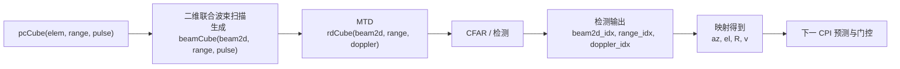
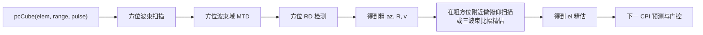

# 当前节点待解决问题

本文档只以 `stepwise_signal_model/` 为主分析对象。  
`joint_holographic_impl/` 只作为思路参考，不作为当前实现的正确依据。

## 1. 当前主线到底是什么

当前 `stepwise_signal_model` 的主线入口是：

- `steps/step_05_joint_2d_mtd/demo_joint_2d_mtd.m`

当前处理链是单个 CPI 内的验证链：

这里的“波束形成”在当前主线中确实是二维联合波束形成，不是先方位后俯仰。

## 2. 当前节点最需要注意的问题

### 2.1 当前主线是验证链，不是工程检测链

当前 `step_05` 主要用于验证：

- 二维联合权值是否构造正确
- 目标峰值是否能在二维波束网格中出现
- MTD 后的距离/速度峰值是否与真值接近

当前还没有形成完整工程链中的：

- 正式检测
- 多目标处理
- 航迹确认
- 跨 CPI 预测和门控

### 2.2 当前主线依赖真值先验

当前存在两处关键真值依赖：

1. 工作子阵选择依赖目标真实方位  
   当前是在目标真实方位附近选工作子阵，而不是通过搜索或预测得到凝视中心。

2. 距离窗依赖目标真实距离轨迹  
   当前只在目标附近的小距离窗内处理，而不是全距离搜索或预测门控。

这意味着当前结果不能直接等价为“工程上已完成检测”。

### 2.3 当前没有正式 CFAR 检测

当前 `step_05` 在二维联合波束形成和 MTD 之后，做的是“全局最大值挑峰”，本质上是验证性找峰，不是检测器。

当前缺少的正式检测环节包括：

- 距离-多普勒二维 CFAR
- 检测单元聚类
- 多目标分离
- 虚警控制

因此，当前主线输出的 `(az, el, R, v)` 更像“真值附近的主峰验证结果”，而不是“工程检测结果”。

### 2.4 第一个 CPI 的获取方式没有定义

如果后续工程链采用“上一 CPI 预测当前 CPI 凝视中心/距离窗”的方式，那么必须先回答第一个 CPI 怎么来。

当前有三种可接受方案：

1. 假设第一个 CPI 已由外部系统提供粗方位和粗距离  
   这是最常见、最省事的工程假设。

2. 第一个 CPI 先做粗搜索捕获  
   例如全距离搜索 + 粗方位扫描。

3. 当前课题暂不研究捕获，只研究进入跟踪后的处理链  
   那就必须在文档里明确写出这个前提。

如果当前重点不是“首帧捕获”，建议直接采用方案 3，并注明：

`第一个 CPI 已获得目标粗方位/粗距离先验`

## 3. 当前最关键的设计分歧：二维联合，还是先方位后俯仰

这一点目前必须明确，否则后续“扫描、检测、精估”会一直混淆。

### 3.1 方案 A：继续采用二维联合波束形成

这条链和当前 `step_05` 的思想一致，只是把真值依赖去掉，并补上正式检测。

优点：

- 逻辑直接，和当前 `step_05` 一致
- 一次扫描同时得到方位和俯仰粗估计

问题：

- 二维波束数较多，计算量和内存压力更大
- 检测维度变成 `beam2d-range-doppler`，实现上更重

### 3.2 方案 B：分级处理，先方位后俯仰

这条链更接近许多工程实现，也更接近三波束比幅的自然使用方式。

优点：

- 计算量通常低于全二维联合扫描
- 更容易和三波束比幅精估结合
- 更适合“先检测、后精估”的工程思路

问题：

- 方位和俯仰被拆成两个阶段
- 需要明确两阶段之间的信息传递方式

### 3.3 当前代码实际情况

当前 `stepwise_signal_model` 里：

- `step_05_joint_2d_mtd` 用的是方案 A 的思路，即二维联合波束形成
- `step_03_az_bf` 和 `step_04_el_bf` 则更像方案 B 所需的单维验证模块

因此当前最需要明确的问题不是“代码里到底有没有波束形成”，而是：

`工程版最终要走方案 A 还是方案 B`

## 4. 三波束比幅测角：当前体现到什么程度

当前 `stepwise_signal_model` 中，三波束比幅思想已经出现，但还没有正式接入主线。

目前已经体现的部分：

- 先找中间粗波束
- 取左、中、右三个相邻波束
- 用目标所在距离单元上的阵列快拍，与三个波束导向矢量做内积
- 比较左束和右束响应大小，判断目标偏左还是偏右

这就是三波束比幅测角的基础思想。

但当前仍有两个缺口：

1. 还没有完成“比幅度量 -> 标定曲线 -> 插值角估计”的完整闭环
2. 参考距离单元当前仍依赖真值，而不是来自正式检测单元

因此，当前状态更准确地说是：

- `step_03` / `step_04` 已经具备三波束比幅的验证雏形
- `step_05` 的二维联合主线还没有接入三波束精估

## 5. 去真值先验后，需要补齐的处理链

如果目标是不依赖真值，当前 CPI 内就必须依靠“扫描 + MTD + 检测”来获得量测。

也就是说，当前 CPI 应该输出：

- 粗方位或二维波束索引
- 距离单元
- 多普勒单元

然后再映射或精估得到：

- `az`
- `el`
- `R`
- `v`

因此要补齐的不是单独一个模块，而是一整段链路：

1. 波束扫描
2. MTD
3. 检测
4. 粗估计
5. 精估计
6. 跨 CPI 预测门控

## 6. 当前建议的待定项

建议把下面几项作为当前节点必须明确的问题：

1. 是否明确采用“第一个 CPI 已有粗先验”的假设  
   如果是，就不把首帧捕获纳入本阶段。

2. 工程链到底采用哪条主线  
   选项 A：二维联合波束形成  
   选项 B：先方位后俯仰

3. 检测是否以二维 CFAR 为默认方案  
   如果是，需要定义检测维度和输出格式。

4. 三波束比幅是否作为角度精估模块接入主线  
   如果接入，需要明确它是在检测之后使用，而不是依赖真值距离单元。

5. 多个 CPI 之间采用什么预测量  
   最少应包含 `az / R / v` 的预测与门控。

## 7. 推荐的当前落地方向

如果希望尽量贴近当前已有代码，并降低改动风险，推荐优先顺序如下：

1. 明确假设  
   先写清楚：`第一个 CPI 已获得粗方位/粗距离先验`

2. 保留当前 `step_05` 的二维联合主线  
   先把“真值距离窗”改成“全距离搜索或预测门控距离窗”

3. 把“全局最大值挑峰”替换为正式检测  
   优先引入 RD 域 CFAR

4. 再决定角度精估方式  
   可继续用二维波束中心作为粗角度，再叠加三波束比幅做精估

这样改动路径最平滑，因为它与当前 `stepwise_signal_model` 的代码结构最一致。
